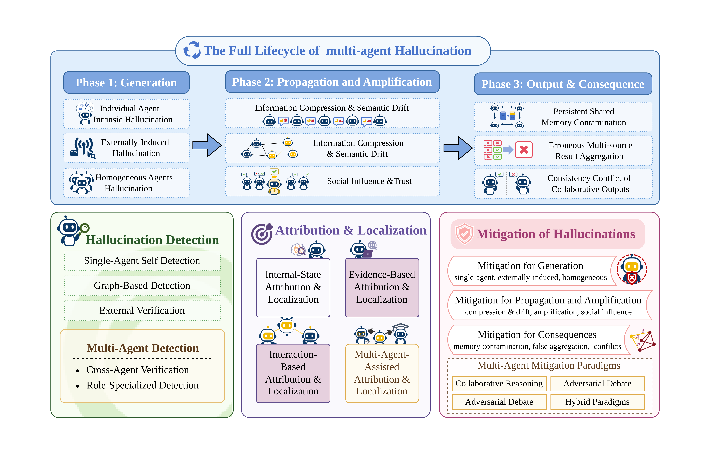

# Hallucination in LLM-Based Multi-Agent Systems

### A Lifecycle-Centered Survey of Origins, Propagation, Detection, Attribution, and Mitigation

**[Paper (coming soon)](#citation) · [Taxonomy](#taxonomy) · [Paper List](#paper-list) · [Benchmarks](#benchmarks-and-metrics) · [Contributing](#contributing)**

## 👋 Overview

This repository is the companion reading list for our survey on **hallucination in LLM-based multi-agent systems (MAS)**.

We define a hallucination as generated content that appears linguistically or logically plausible but is factually incorrect, unsupported by available evidence, or inconsistent with the task context. In a multi-agent system, hallucination is not only a local generation error. It can be **introduced by one agent, transformed during communication, amplified by the interaction topology, accepted through social influence, embedded in shared memory, and ultimately consolidated into a confident but incorrect collective output**.

Accordingly, this repository studies two complementary directions:

1. **Hallucinations within multi-agent systems:** how errors originate, propagate, amplify, and shape system-level outcomes.
2. **Multi-agent systems for hallucination governance:** how multiple agents can support detection, attribution, localization, verification, and mitigation.

Unlike static taxonomies that classify only the final erroneous response, our organization follows the **full hallucination lifecycle** and connects it to an actionable governance loop.

## 🎉 News

- **[2026-08]** Initial release of the lifecycle-centered taxonomy and curated reading list.
- **[2026-08]** Added the full-lifecycle overview figure and a unified visual icon system.
- The paper link and official BibTeX will be added after public release.

## 📑 Contents

- [Overview](#overview)
- [Overall Framework](#overall-framework)
- [Taxonomy](#taxonomy)
- [Paper List](#paper-list)
  - [Stage I: Hallucination Origin](#stage-i-hallucination-origin)
  - [Stage II: Propagation and Amplification](#stage-ii-propagation-and-amplification)
  - [Stage III: System-Level Outcomes](#stage-iii-system-level-outcomes)
  - [Detection](#detection)
  - [Attribution and Localization](#attribution-and-localization)
  - [Mitigation](#mitigation)
- [Benchmarks and Metrics](#benchmarks-and-metrics)
- [Contributing](#contributing)

## 🗺️ Overall Framework

 

  <em>Figure 1. The full lifecycle of multi-agent hallucination, together with detection, attribution and localization, and lifecycle-aligned mitigation.</em>

## 🧭 Taxonomy

The framework above traces how a local error can evolve into a persistent system-level failure. The table below provides a compact, searchable version of the taxonomy.

| Layer | Research question | Main categories |
| --- | --- | --- |
| **🧬 Stage I — Origin** | Where does the first unsupported or incorrect belief arise? | Intrinsic agent errors; environment-induced errors; correlated errors among homogeneous agents |
| **🔄 Stage II — Propagation** | How does a local error move across the system and gain influence? | Information compression and semantic drift; topology-driven cascades; conformity, authority, and trust mismatch |
| **🎯 Stage III — Outcomes** | How does the error become a persistent system-level failure? | Memory contamination; aggregation failure; unresolved cross-agent disagreement |
| **🔍 Detection** | Is a claim, step, message, or trajectory hallucinated? | Internal-state, external-evidence, graph-based, trajectory-level, and multi-agent detection |
| **🧭 Attribution** | Who introduced, propagated, amplified, or finalized the error—and when? | Internal, evidence-based, interaction-based, causal, and contribution-based localization |
| **🛡️ Mitigation** | Which intervention addresses the identified cause with acceptable cost? | Source control; communication and topology control; aggregation and memory repair; collaborative verification |

> **Scope note.** A paper may fit more than one category. We place each work under its primary contribution and cross-reference it when necessary. Preprints are marked as **arXiv**; venue metadata should be updated when a paper is formally published.

## 📚 Paper List

### 🧬 Stage I: Hallucination Origin

#### 1. Intrinsic single-agent hallucination

<strong>Perception and input grounding</strong>

- 📄 **ICLR 2024** — [Analyzing and Mitigating Object Hallucination in Large Vision-Language Models](https://arxiv.org/abs/2310.00754)
- 📄 **CVPR 2024** — [Mitigating Object Hallucinations in Large Vision-Language Models through Visual Contrastive Decoding](https://openaccess.thecvf.com/content/CVPR2024/html/Leng_Mitigating_Object_Hallucinations_in_Large_Vision-Language_Models_through_Visual_Contrastive_CVPR_2024_paper.html)
- 📄 **Findings of ACL 2024** — [Mitigating Hallucinations in Large Vision-Language Models with Instruction Contrastive Decoding](https://aclanthology.org/2024.findings-acl.937/)
- 📄 **CVPR 2024** — [Multi-Modal Hallucination Control by Visual Information Grounding](https://openaccess.thecvf.com/content/CVPR2024/html/Favero_Multi-Modal_Hallucination_Control_by_Visual_Information_Grounding_CVPR_2024_paper.html)
- 📄 **NeurIPS 2025** — [More Thinking, Less Seeing? Assessing Amplified Hallucination in Multimodal Reasoning Models](https://proceedings.neurips.cc/paper_files/paper/2025/hash/777db387a5ccb131ba8c7cd155166b85-Abstract-Conference.html)
- 📄 **AAAI 2025** — [Is There No Such Thing as a Bad Question? H4R: HalluciBot for Ratiocination, Rewriting, Ranking, and Routing](https://ojs.aaai.org/index.php/AAAI/article/view/34736)
- 📄 **Findings of ACL 2026** — [System-Mediated Attention Imbalances Make Vision-Language Models Say Yes](https://aclanthology.org/2026.findings-acl.1940/)

<strong>Reasoning, planning, and tool use</strong>

- 📄 **NeurIPS 2023** — [Deductive Verification of Chain-of-Thought Reasoning](https://proceedings.neurips.cc/paper_files/paper/2023/hash/72393bd47a35f5b3bee4c609e7bba733-Abstract-Conference.html)
- 📄 **ICML 2024** — [How Language Model Hallucinations Can Snowball](https://proceedings.mlr.press/v235/zhang24ay.html)
- 📄 **EMNLP 2024** — [ToolBeHonest: A Multi-level Hallucination Diagnostic Benchmark for Tool-Augmented Large Language Models](https://aclanthology.org/2024.emnlp-main.637/)
- 📄 **NeurIPS 2025** — [Reasoning Models Hallucinate More: Factuality-Aware Reinforcement Learning for Large Reasoning Models](https://proceedings.neurips.cc/paper_files/paper/2025/hash/ddd50f29fa472095515fa0df31749e6c-Abstract-Conference.html)
- 📄 **NeurIPS 2025** — [Auditing Meta-Cognitive Hallucinations in Reasoning Large Language Models](https://proceedings.neurips.cc/paper_files/paper/2025/hash/ee0e336e2423430ef86071300299e074-Abstract-Conference.html)
- 📄 **ACL 2026** — [The Reasoning Trap: How Enhancing LLM Reasoning Amplifies Tool Hallucination](https://aclanthology.org/2026.acl-long.376/)

<strong>Parametric, contextual, and multimodal knowledge</strong>

- 📄 **TACL 2024** — [Lost in the Middle: How Language Models Use Long Contexts](https://aclanthology.org/2024.tacl-1.9/)
- 📄 **ICLR 2024** — [Adaptive Chameleon or Stubborn Sloth: Revealing the Behavior of Large Language Models in Knowledge Conflicts](https://arxiv.org/abs/2305.13300)
- 📄 **NeurIPS 2024** — [FLAME: Factuality-Aware Alignment for Large Language Models](https://proceedings.neurips.cc/paper_files/paper/2024/hash/d16152d53088ad779ffa634e7bf66166-Abstract-Conference.html)
- 📄 **Findings of ACL 2025** — [The Law of Knowledge Overshadowing: Towards Understanding, Predicting and Preventing LLM Hallucination](https://aclanthology.org/2025.findings-acl.1199/)
- 📄 **NeurIPS 2025** — [Why and How LLMs Hallucinate: Connecting the Dots with Subsequence Associations](https://proceedings.neurips.cc/paper_files/paper/2025/hash/3255a7554605a88800f4e120b3a929e1-Abstract-Conference.html)
- 📄 **NeurIPS 2025** — [Generalization or Hallucination? Understanding Out-of-Context Reasoning in Transformers](https://papers.nips.cc/paper_files/paper/2025/hash/cc7c9c8e4a84b0ca00d874e1a8938644-Abstract-Conference.html)
- 📄 **ACL 2025** — [Alleviating Hallucinations from Knowledge Misalignment in Large Language Models via Selective Abstention Learning](https://aclanthology.org/2025.acl-long.1199/)
- 📄 **ACL 2025** — [Insight Over Sight: Exploring the Vision-Knowledge Conflicts in Multimodal LLMs](https://aclanthology.org/2025.acl-long.872/)

<strong>Decoding and generation</strong>

- 📄 **NeurIPS 2022** — [Factuality Enhanced Language Models for Open-Ended Text Generation](https://proceedings.neurips.cc/paper_files/paper/2022/hash/df438caa36714f69277daa92d608dd63-Abstract-Conference.html)
- 📄 **ACL 2024** — [The Dawn After the Dark: An Empirical Study on Factuality Hallucination in Large Language Models](https://aclanthology.org/2024.acl-long.586/)
- 📄 **TACL 2025** — [REAL Sampling: Boosting Factuality and Diversity of Open-ended Generation by Extrapolating the Entropy of an Infinitely Large LM](https://aclanthology.org/2025.tacl-1.35/)

#### 2. Environment-induced hallucination

<strong>External knowledge and retrieval defects</strong>

- 📄 **EMNLP 2024** — [Do You Know What You Are Talking About? Characterizing Query-Knowledge Relevance for Reliable Retrieval-Augmented Generation](https://aclanthology.org/2024.emnlp-main.353/)
- 📄 **EMNLP 2024** — [RULE: Reliable Multimodal RAG for Factuality in Medical Vision-Language Models](https://aclanthology.org/2024.emnlp-main.62/)
- 📄 **ACL 2025** — [Removal of Hallucination on Hallucination: Debate-Augmented RAG](https://aclanthology.org/2025.acl-long.770/)
- 📄 **ACL 2025** — [FaithfulRAG: Fact-Level Conflict Modeling for Context-Faithful Retrieval-Augmented Generation](https://aclanthology.org/2025.acl-long.1062/)
- 📄 **ACL 2025** — [LLMs Trust Humans More, That's a Problem! Unveiling and Mitigating the Authority Bias in Retrieval-Augmented Generation](https://aclanthology.org/2025.acl-long.1400/)
- 📄 **EMNLP 2025** — [Mitigating Hallucination of LLMs with Shared-Private Knowledge Synergy](https://aclanthology.org/2025.emnlp-main.549/)
- 📄 **EMNLP 2025** — [Retrieval-Augmented Generation with Estimation of Source Reliability](https://aclanthology.org/2025.emnlp-main.1738/)

<strong>Ambiguous, false, or adversarial user input</strong>

- 📄 **EMNLP 2024** — [Whispers that Shake Foundations: Analyzing and Mitigating False Premise Hallucinations in Large Language Models](https://aclanthology.org/2024.emnlp-main.155/)
- 📄 **EMNLP 2024** — [Aligning Language Models to Explicitly Handle Ambiguity](https://aclanthology.org/2024.emnlp-main.119/)
- 📄 **Findings of ACL 2025** — [Lightweight Query Checkpoint: Classifying Faulty User Queries to Mitigate Hallucinations in Large Language Model Question Answering](https://aclanthology.org/2025.findings-acl.756/)
- 📄 **ACL 2025** — [Beyond Facts: Evaluating Intent Hallucination in Large Language Models](https://aclanthology.org/2025.acl-long.349/)
- 📄 **EMNLP 2025** — [Detecting LLM Hallucination Through Layer-wise Information Deficiency: Analysis of Ambiguous Prompts and Unanswerable Questions](https://aclanthology.org/2025.emnlp-main.1644/)

<strong>Environmental observations and feedback</strong>

- 📄 **Findings of EMNLP 2025** — [HEAL: An Empirical Study on Hallucinations in Embodied Agents Driven by Large Language Models](https://aclanthology.org/2025.findings-emnlp.1158/)
- 📄 **Findings of ACL 2026** — [Characterizing the Robustness of Black-Box LLM Planners Under Perturbed Observations with Adaptive Stress Testing](https://aclanthology.org/2026.findings-acl.1966/)

#### 3. Correlated failures among homogeneous agents

- 📄 **NeurIPS 2025** — [Why Do Multi-Agent LLM Systems Fail?](https://papers.nips.cc/paper_files/paper/2025/hash/b1041e52d3be19f0a9bc491657488e4a-Abstract-Datasets_and_Benchmarks_Track.html)
- 📄 **arXiv 2025** — [Talk Isn't Always Cheap: Understanding Failure Modes in Multi-Agent Debate](https://arxiv.org/abs/2509.05396)
- 📄 **arXiv 2025** — [If Multi-Agent Debate Is the Answer, What Is the Question?](https://arxiv.org/abs/2502.08788)
- 📄 **ACM AI and Agentic Systems 2026** — [The Cost of Consensus: Isolated Self-Correction Prevails Over Unguided Homogeneous Multi-Agent Debate](https://dl.acm.org/doi/10.1145/3786335.3813137)
- 📄 **Findings of ACL 2026** — [Diversity Collapse in Multi-Agent LLM Systems: Structural Coupling and Collective Failure in Open-Ended Idea Generation](https://aclanthology.org/2026.findings-acl.13/)
- 📄 **arXiv 2026** — [Representational Collapse in Multi-Agent LLM Committees](https://arxiv.org/abs/2604.03809)
- 📄 **arXiv 2026** — [Multi-LLM Systems Exhibit Robust Semantic Collapse](https://arxiv.org/abs/2605.17193)
- 📄 **arXiv 2026** — [Breaking the Martingale Curse: Multi-Agent Debate via Asymmetric Cognitive Potential Energy](https://arxiv.org/abs/2603.06801)
- 📄 **arXiv 2026** — [Minority Sentinel: When to Overturn Majority Voting in Multi-Agent LLM Debates](https://arxiv.org/abs/2606.29270)
- 📄 **arXiv 2026** — [The Consensus Trap: Rescuing Multi-Agent LLMs from Adversarial Majorities via Token-Level Collaboration](https://arxiv.org/abs/2604.17139)

### 🔄 Stage II: Propagation and Amplification

#### 1. Information compression and semantic drift

- 📄 **EMNLP 2025** — [Augmenting Multi-Agent Communication with State Delta Trajectory](https://aclanthology.org/2025.emnlp-main.518/)
- 📄 **arXiv 2026** — [Semantic Register Compression in Multi-Agent LLM Cascades](https://arxiv.org/abs/2607.14119)
- 📄 **arXiv 2025** — [Why Do AI Agents Communicate in Human Language?](https://arxiv.org/abs/2506.02739)
- 📄 **ICML 2025** — [Direct Semantic Communication Between Large Language Models via Vector Translation](https://icml.cc/virtual/2025/50492)
- 📄 **NeurIPS 2025 (Position Track)** — [Large Language Models Miss the Multi-Agent Mark](https://arxiv.org/abs/2505.21298)

#### 2. Topology-driven cascades

- 📄 **Findings of ACL 2025** — [NetSafe: Exploring the Topological Safety of Multi-Agent Systems](https://aclanthology.org/2025.findings-acl.150/)
- 📄 **arXiv 2026** — [Misinformation Propagation in Benign Multi-Agent Systems](https://arxiv.org/abs/2606.16710)
- 📄 **arXiv 2026** — [Collective Hallucination in Multi-Agent LLMs: Modeling and Defense](https://arxiv.org/abs/2606.07941)
- 📄 **arXiv 2026** — [Hallucination Cascade: Analyzing Error Propagation in Multi-Agent LLM Systems](https://arxiv.org/abs/2606.07937)
- 📄 **arXiv 2026** — [From Spark to Fire: Modeling and Mitigating Error Cascades in LLM-Based Multi-Agent Collaboration](https://arxiv.org/abs/2603.04474)
- 📄 **Science China Information Sciences 2026** — [Flooding Spread of Manipulated Knowledge in LLM-Based Multi-Agent Communities](https://link.springer.com/article/10.1007/s11432-024-4663-2)
- 📄 **arXiv 2025** — [Simulating Rumor Spreading in Social Networks Using LLM Agents](https://arxiv.org/abs/2502.01450)
- 📄 **IJCAI 2024** — [An LLM-Enhanced Agent-Based Simulation Tool for Information Propagation](https://www.ijcai.org/proceedings/2024/1007)
- 📄 **IJCAI 2025** — [Simulating Misinformation Diffusion on Social Media Through CoNVaI](https://www.ijcai.org/proceedings/2025/29)
- 📄 **ACL 2025** — [Beyond Frameworks: Unpacking Collaboration Strategies in Multi-Agent Systems](https://aclanthology.org/2025.acl-long.1037/)
- 📄 **ACL 2025** — [MultiAgentBench: Evaluating the Collaboration and Competition of LLM Agents](https://aclanthology.org/2025.acl-long.421/)
- 📄 **arXiv 2026** — [Conformity Dynamics in LLM Multi-Agent Systems: The Roles of Topology and Self-Social Weighting](https://arxiv.org/abs/2601.05606)

#### 3. Social influence, conformity, and trust mismatch

- 📄 **arXiv 2025** — [Herd Behavior: Investigating Peer Influence in LLM-Based Multi-Agent Systems](https://arxiv.org/abs/2505.21588)
- 📄 **Findings of ACL 2025** — [An Empirical Study of Group Conformity in Multi-Agent Systems](https://aclanthology.org/2025.findings-acl.265/)
- 📄 **Scientific Reports 2026** — [When Collaboration Fails: Persuasion-Driven Adversarial Influence in Multi-Agent Large Language Model Debate](https://doi.org/10.1038/s41598-026-42705-7)
- 📄 **AAAI 2026** — [Key Decision-Makers in Multi-Agent Debates: Who Holds the Power?](https://ojs.aaai.org/index.php/AAAI/article/view/40235)
- 📄 **arXiv 2026** — [Belief in Authority: Impact of Authority in Multi-Agent Evaluation Framework](https://arxiv.org/abs/2601.04790)
- 📄 **ICLR 2024** — [Towards Understanding Sycophancy in Language Models](https://openreview.net/forum?id=tvhaxkMKAn)
- 📄 **arXiv 2023** — [Simple Synthetic Data Reduces Sycophancy in Large Language Models](https://arxiv.org/abs/2308.03958)
- 📄 **ICLR 2025** — [Do as We Do, Not as You Think: The Conformity of Large Language Models](https://arxiv.org/abs/2501.13381)
- 📄 **arXiv 2026** — [Easier to Mislead Than to Correct: Harmful and Beneficial Revision in LLM Conformity](https://arxiv.org/abs/2606.01637)
- 📄 **ACL 2026** — [When Identity Skews Debate: Anonymization for Bias-Reduced Multi-Agent Reasoning](https://aclanthology.org/2026.acl-long.650/)
- 📄 **arXiv 2026** — [Conformity Dynamics in LLM Multi-Agent Systems: The Roles of Topology and Self-Social Weighting](https://arxiv.org/abs/2601.05606)

### 🎯 Stage III: System-Level Outcomes

#### 1. Memory contamination

- 📄 **arXiv 2025** — [HaluMem: Evaluating Hallucinations in Memory Systems of Agents](https://arxiv.org/abs/2511.03506)
- 📄 **arXiv 2025** — [ABBEL: LLM Agents Acting through Belief Bottlenecks Expressed in Language](https://arxiv.org/abs/2512.20111)
- 📄 **arXiv 2026** — [ConsistencyGate: Preventing Memory Contamination in LLM Agents via Self-Consistency Admission Control](https://arxiv.org/abs/2607.22962)
- 📄 **arXiv 2026** — [MemGuard: Preventing Memory Contamination in Long-Term Memory-Augmented Large Language Models](https://arxiv.org/abs/2605.28009)
- 📄 **ACL 2026** — [How Memory Management Impacts LLM Agents: An Empirical Study of Experience-Following Behavior](https://aclanthology.org/2026.acl-long.27/)
- 📄 **arXiv 2026** — [Honest Lying: Understanding Memory Confabulation in Reflexive Agents](https://arxiv.org/abs/2605.29463)
- 📄 **arXiv 2026** — [EquiMem: Calibrating Shared Memory in Multi-Agent Debate via Game-Theoretic Equilibrium](https://arxiv.org/abs/2605.09278)
- 📄 **arXiv 2026** — [Governing Evolving Memory in LLM Agents: Risks, Mechanisms, and the Stability and Safety Governed Memory Framework](https://arxiv.org/abs/2603.11768)
- 📄 **arXiv 2026** — [Beyond Static Summarization: Proactive Memory Extraction for LLM Agents](https://arxiv.org/abs/2601.04463)
- 📄 **ICLR 2025** — [Agent Security Bench: Formalizing and Benchmarking Attacks and Defenses in LLM-Based Agents](https://proceedings.iclr.cc/paper_files/paper/2025/hash/5750f91d8fb9d5c02bd8ad2c3b44456b-Abstract-Conference.html)
- 📄 **ACL 2026** — [Visual Inception: Compromising Long-Term Planning in Agentic Recommenders via Multimodal Memory Poisoning](https://aclanthology.org/2026.acl-long.954/)

#### 2. Aggregation and collective-decision failure

- 📄 **Findings of ACL 2025** — [Voting or Consensus? Decision-Making in Multi-Agent Debate](https://aclanthology.org/2025.findings-acl.606/)
- 📄 **arXiv 2024** — [LLM Voting: Human Choices and AI Collective Decision Making](https://arxiv.org/abs/2402.01766)
- 📄 **NeurIPS 2025** — [Multi-Agent Debate for LLM Judges with Adaptive Stability Detection](https://proceedings.neurips.cc/paper_files/paper/2025/hash/42475c537936b2394b5015e871765056-Abstract-Conference.html)
- 📄 **arXiv 2026** — [Auditing Multi-Agent LLM Reasoning Trees Outperforms Majority Vote and LLM-as-Judge](https://arxiv.org/abs/2602.09341)
- 📄 **ACL 2024** — [Large Language Models Are Not Fair Evaluators](https://aclanthology.org/2024.acl-long.511/)
- 📄 **arXiv 2024** — [Large Language Models Are Inconsistent and Biased Evaluators](https://arxiv.org/abs/2405.01724)
- 📄 **arXiv 2024** — [Replacing Judges with Juries: Evaluating LLM Generations with a Panel of Diverse Models](https://arxiv.org/abs/2404.18796)
- 📄 **NeurIPS 2023** — [Judging LLM-as-a-Judge with MT-Bench and Chatbot Arena](https://proceedings.neurips.cc/paper_files/paper/2023/hash/91f18a1287b398d378ef22505bf41832-Abstract-Datasets_and_Benchmarks.html)
- 📄 **ACL 2024** — [Exploring Collaboration Mechanisms for LLM Agents: A Social Psychology View](https://aclanthology.org/2024.acl-long.782/)
- 📄 **NeurIPS 2025** — [Debate or Vote: Which Yields Better Decisions in Multi-Agent Large Language Models?](https://papers.nips.cc/paper_files/paper/2025/hash/934252acd87f254d5d4672fbde283bd2-Abstract-Conference.html)
- 📄 **arXiv 2026** — [Misinformation Propagation in Benign Multi-Agent Systems](https://arxiv.org/abs/2606.16710)
- 📄 **AAAI Workshop on Multi-Agent Systems 2025** — [Reliable Decision-Making for Multi-Agent LLM Systems](https://multiagents.org/2025_artifacts/reliable_decision_making_for_multi_agent_llm_systems.pdf)

#### 3. Persistent cross-agent disagreement

- 📄 **EACL 2026** — [DART: Leveraging Multi-Agent Disagreement for Tool Recruitment in Multimodal Reasoning](https://aclanthology.org/2026.eacl-long.253/)
- 📄 **arXiv 2025** — [When Disagreements Elicit Robustness: Investigating Self-Repair Capabilities under LLM Multi-Agent Disagreements](https://arxiv.org/abs/2502.15153)
- 📄 **arXiv 2026** — [The Consistency Illusion: How Multi-Agent Debate Hides Reasoning Misalignment](https://arxiv.org/abs/2606.08457)
- 📄 **arXiv 2025** — [Enhancing LLM Performance Through Debate: An Empirical Study on Multi-Agent Debate for Coding Tasks](https://arxiv.org/abs/2503.12029)
- 📄 **ACL 2025** — [Multiple LLM Agents Debate for Equitable Cultural Alignment](https://aclanthology.org/2025.acl-long.1210/)
- 📄 **EMNLP 2025** — [The Hidden Strength of Disagreement: Unraveling the Consensus-Diversity Tradeoff in Adaptive Multi-Agent Systems](https://aclanthology.org/2025.emnlp-main.772/)
- 📄 **ACL 2024** — [ReConcile: Round-Table Conference Improves Reasoning via Consensus among Diverse LLMs](https://aclanthology.org/2024.acl-long.381/)
- 📄 **ICML 2024** — [Should We Be Going MAD? A Look at Multi-Agent Debate Strategies for LLMs](https://proceedings.mlr.press/v235/smit24a.html)
- 📄 **arXiv 2025** — [Reaching Agreement Among Reasoning LLM Agents](https://arxiv.org/abs/2512.20184)
- 📄 **arXiv 2026** — [Collaborative Disagreement Resolution for Scalable Oversight](https://arxiv.org/abs/2607.01251)
- 📄 **ICLR Workshop 2026** — [When AI Agents Disagree Like Humans: Reasoning Trace Analysis for Human-AI Collaborative Moderation](https://arxiv.org/abs/2604.03796)

### 🔍 Detection

#### 1. Internal-state, uncertainty, and self-consistency detection

- 📄 **EMNLP 2023** — [SelfCheckGPT: Zero-Resource Black-Box Hallucination Detection for Generative Large Language Models](https://aclanthology.org/2023.emnlp-main.557/)
- 📄 **arXiv 2024** — [INSIDE: LLMs' Internal States Retain the Power of Hallucination Detection](https://arxiv.org/abs/2402.03744)
- 📄 **arXiv 2023** — [Self-Contradictory Hallucinations of Large Language Models: Evaluation, Detection and Mitigation](https://arxiv.org/abs/2305.15852)
- 📄 **Nature 2024** — [Detecting Hallucinations in Large Language Models Using Semantic Entropy](https://www.nature.com/articles/s41586-024-07421-0)
- 📄 **NeurIPS 2024** — [LLM-Check: Investigating Detection of Hallucinations in Large Language Models](https://papers.nips.cc/paper_files/paper/2024/hash/3c1e1fdf305195cd620c118aaa9717ad-Abstract-Conference.html)
- 📄 **ICLR 2025** — [LLMs Know More Than They Show: On the Intrinsic Representation of LLM Hallucinations](https://proceedings.iclr.cc/paper_files/paper/2025/hash/a712d461e57201efe35d429a6f1731c1-Abstract-Conference.html)
- 📄 **ICLR 2025** — [HaDeMiF: Hallucination Detection and Mitigation in Large Language Models](https://proceedings.iclr.cc/paper_files/paper/2025/hash/c98987c5ec4f30920d7190dc699e3daf-Abstract-Conference.html)
- 📄 **IJCAI 2025** — [Detecting Hallucination in Large Language Models Through Deep Internal Representation Analysis](https://www.ijcai.org/proceedings/2025/929)
- 📄 **ACL 2025** — [ICR Probe: Tracking Hidden State Dynamics for Reliable Hallucination Detection in LLMs](https://aclanthology.org/2025.acl-long.880/)
- 📄 **ICCV 2025** — [Hallucinatory Image Tokens: A Training-free EAZY Approach to Detecting and Mitigating Object Hallucinations in LVLMs](https://openaccess.thecvf.com/content/ICCV2025/html/Che_Hallucinatory_Image_Tokens_A_Training-free_EAZY_Approach_to_Detecting_and_ICCV_2025_paper.html)
- 📄 **NeurIPS 2025** — [Beyond Token Probes: Hallucination Detection via Activation Tensors with ACT-ViT](https://proceedings.neurips.cc/paper_files/paper/2025/hash/7b8694d58c34b9bec9c2f29735c3a250-Abstract-Conference.html)
- 📄 **AAAI 2026** — [Joint Evaluation of Answer and Reasoning Consistency for Hallucination Detection in Large Reasoning Models](https://ojs.aaai.org/index.php/AAAI/article/view/40624)

#### 2. External knowledge and tool-grounded detection

- 📄 **ACL 2026** — [MARCH: Multi-Agent Reinforced Check for LLM Hallucination](https://aclanthology.org/2026.acl-long.1828/)
- 📄 **arXiv 2026** — [CuraView: A Multi-Agent Framework for Medical Hallucination Detection with GraphRAG-Enhanced Knowledge Verification](https://arxiv.org/abs/2605.03476)
- 📄 **arXiv 2026** — [MERMAID: Memory-Enhanced Retrieval and Reasoning with Multi-Agent Iterative Knowledge Grounding for Veracity Assessment](https://arxiv.org/abs/2601.22361)
- 📄 **AAAI 2024** — [Mitigating Large Language Model Hallucinations via Autonomous Knowledge Graph-Based Retrofitting](https://ojs.aaai.org/index.php/AAAI/article/view/29770)
- 📄 **ICLR 2024** — [Think-on-Graph: Deep and Responsible Reasoning of Large Language Models on Knowledge Graphs](https://proceedings.iclr.cc/paper_files/paper/2024/hash/10a6bdcabbd5a3d36b760daa295f63c1-Abstract-Conference.html)
- 📄 **AAAI 2026** — [ProgRAG: Hallucination-Resistant Progressive Retrieval and Reasoning over Knowledge Graphs](https://ojs.aaai.org/index.php/AAAI/article/view/40545)
- 📄 **EMNLP 2023** — [FActScore: Fine-Grained Atomic Evaluation of Factual Precision in Long-Form Text Generation](https://aclanthology.org/2023.emnlp-main.741/)
- 📄 **NeurIPS 2024** — [Long-Form Factuality in Large Language Models](https://proceedings.neurips.cc/paper_files/paper/2024/hash/937ae0e83eb08d2cb8627fe1def8c751-Abstract-Conference.html)

#### 3. Graph-based propagation detection

- 📄 **NeurIPS 2025** — [GUARDIAN: Safeguarding LLM Multi-Agent Collaborations with Temporal Graph Modeling](https://proceedings.neurips.cc/paper_files/paper/2025/hash/0bc795afae289ed465a65a3b4b1f4eb7-Abstract-Conference.html)
- 📄 **AAAI 2026** — [MPAS: Breaking Sequential Constraints of Multi-Agent Communication Topologies via Individual-Epistemic Message Propagation](https://ojs.aaai.org/index.php/AAAI/article/view/40231)
- 📄 **arXiv 2026** — [Hallucination Cascade: Analyzing Error Propagation in Multi-Agent LLM Systems](https://arxiv.org/abs/2606.07937)
- 📄 **arXiv 2026** — [Collective Hallucination in Multi-Agent LLMs: Modeling and Defense](https://arxiv.org/abs/2606.07941)
- 📄 **arXiv 2026** — [From Spark to Fire: Modeling and Mitigating Error Cascades in LLM-Based Multi-Agent Collaboration](https://arxiv.org/abs/2603.04474)

#### 4. Trajectory-level detection

- 📄 **arXiv 2026** — [Beyond Final Answers: Auditing Trajectory-Level Hallucinations in Multi-Agent Industrial Workflows](https://arxiv.org/abs/2605.24219)
- 📄 **arXiv 2026** — [AgentHallu: Benchmarking Automated Hallucination Attribution of LLM-Based Agents](https://arxiv.org/abs/2601.06818)
- 📄 **arXiv 2025** — [MIRAGE-Bench: LLM Agent Is Hallucinating and Where to Find Them](https://arxiv.org/abs/2507.21017)
- 📄 **NeurIPS 2025** — [Why Do Multi-Agent LLM Systems Fail?](https://papers.nips.cc/paper_files/paper/2025/hash/b1041e52d3be19f0a9bc491657488e4a-Abstract-Datasets_and_Benchmarks_Track.html)
- 📄 **ICLR 2025** — [Agent Security Bench: Formalizing and Benchmarking Attacks and Defenses in LLM-Based Agents](https://proceedings.iclr.cc/paper_files/paper/2025/hash/5750f91d8fb9d5c02bd8ad2c3b44456b-Abstract-Conference.html)

#### 5. Multi-agent detection and fact-checking

- 📄 **arXiv 2026** — [Tool-MAD: A Multi-Agent Debate Framework for Fact Verification with Diverse Tool Augmentation and Adaptive Retrieval](https://arxiv.org/abs/2601.04742)
- 📄 **ACM 2026** — [CSMAD: Hallucination Detection via Multi-Agent Debate with NLI-Verified Contradictory Statements](https://dl.acm.org/doi/10.1145/3805712.3808508)
- 📄 **arXiv 2025** — [MAD-Fact: A Multi-Agent Debate Framework for Long-Form Factuality Evaluation in LLMs](https://arxiv.org/abs/2510.22967)
- 📄 **NAACL 2025** — [Faithful, Unfaithful or Ambiguous? Multi-Agent Debate with Initial Stance for Summary Evaluation](https://aclanthology.org/2025.naacl-long.609/)
- 📄 **NLPCC 2025** — [MAD-HD: Multi-Agent Debate-Driven Ungrounded Hallucination Detection](https://link.springer.com/chapter/10.1007/978-981-95-3343-5_39)
- 📄 **FEVER 2025** — [EMULATE: A Multi-Agent Framework for Determining the Veracity of Atomic Claims by Emulating Human Actions](https://aclanthology.org/2025.fever-1.13/)
- 📄 **arXiv 2025** — [Towards Robust Fact-Checking: A Multi-Agent System with Advanced Evidence Retrieval](https://arxiv.org/abs/2506.17878)
- 📄 **Findings of ACL 2026** — [GAVEL: Evidence-Contract Debate with Mechanized Scrutiny for Provenance-Grounded Fact-Checking](https://aclanthology.org/2026.findings-acl.1789)
- 📄 **arXiv 2026** — [Source or It Didn't Happen: A Multi-Agent Framework for Citation Hallucination Detection](https://arxiv.org/abs/2605.08583)
- 📄 **arXiv 2026** — [OptArgus: A Multi-Agent System to Detect Hallucinations in LLM-Based Optimization Modeling](https://arxiv.org/abs/2605.11738)
- 📄 **ACL 2026** — [MARCH: Multi-Agent Reinforced Check for Hallucination](https://aclanthology.org/2026.acl-long.1828/)
- 📄 **FLINS-ISKE 2026** — [A Multi-Agent Framework for Factuality Hallucination Detection Using Complex Knowledge Graph](https://link.springer.com/chapter/10.1007/978-981-92-2480-7_10)

### 🧭 Attribution and Localization

#### 1. Internal-state attribution

- 📄 **Findings of ACL 2024** — [Unsupervised Real-Time Hallucination Detection Based on the Internal States of Large Language Models](https://aclanthology.org/2024.findings-acl.854/)
- 📄 **arXiv 2024** — [INSIDE: LLMs' Internal States Retain the Power of Hallucination Detection](https://arxiv.org/abs/2402.03744)
- 📄 **EMNLP 2024** — [Lookback Lens: Detecting and Mitigating Contextual Hallucinations in Large Language Models Using Only Attention Maps](https://aclanthology.org/2024.emnlp-main.84/)
- 📄 **ACL 2025** — [ICR Probe: Tracking Hidden State Dynamics for Reliable Hallucination Detection in LLMs](https://aclanthology.org/2025.acl-long.880/)
- 📄 **ACL 2026** — [LAFaCT: Attribution-Based Localization and Focused Sequential Analysis of Fact-Critical Tokens for Hallucination Detection](https://aclanthology.org/2026.acl-long.312/)
- 📄 **ACL 2026** — [TPA: Next Token Probability Attribution for Detecting Hallucinations in RAG](https://aclanthology.org/2026.acl-long.1159/)

#### 2. External-evidence attribution

- 📄 **EMNLP 2023** — [FActScore: Fine-Grained Atomic Evaluation of Factual Precision in Long-Form Text Generation](https://aclanthology.org/2023.emnlp-main.741/)
- 📄 **ACL 2023** — [RARR: Researching and Revising What Language Models Say, Using Language Models](https://aclanthology.org/2023.acl-long.910/)
- 📄 **NeurIPS 2024** — [Long-Form Factuality in Large Language Models](https://proceedings.neurips.cc/paper_files/paper/2024/hash/937ae0e83eb08d2cb8627fe1def8c751-Abstract-Conference.html)
- 📄 **Findings of EMNLP 2024** — [VeriScore: Evaluating the Factuality of Verifiable Claims in Long-Form Text Generation](https://aclanthology.org/2024.findings-emnlp.552/)
- 📄 **Findings of EMNLP 2025** — [VeriFastScore: Speeding Up Long-Form Factuality Evaluation](https://aclanthology.org/2025.findings-emnlp.491/)

#### 3. Interaction, causal, and contribution attribution

- 📄 **NeurIPS 2025** — [GUARDIAN: Safeguarding LLM Multi-Agent Collaborations with Temporal Graph Modeling](https://arxiv.org/abs/2505.19234)
- 📄 **ICML 2025** — [Which Agent Causes Task Failures and When? On Automated Failure Attribution of LLM Multi-Agent Systems](https://proceedings.mlr.press/v267/zhang25cq.html)
- 📄 **arXiv 2025** — [AgenTracer: Who Is Inducing Failure in LLM Agentic Systems?](https://arxiv.org/abs/2509.03312)
- 📄 **arXiv 2026** — [From Flat Logs to Causal Graphs: Hierarchical Failure Attribution for LLM-Based Multi-Agent Systems](https://arxiv.org/abs/2602.23701)
- 📄 **arXiv 2026** — [From Spark to Fire: Modeling and Mitigating Error Cascades in LLM-Based Multi-Agent Collaboration](https://arxiv.org/abs/2603.04474)
- 📄 **arXiv 2025** — [Automatic Failure Attribution and Critical Step Prediction for Multi-Agent Systems Based on Causal Inference](https://arxiv.org/abs/2509.08682)
- 📄 **AAAI 2026** — [HiveMind: Contribution-Guided Online Prompt Optimization of LLM Multi-Agent Systems](https://ojs.aaai.org/index.php/AAAI/article/view/40222)
- 📄 **arXiv 2026** — [Agents That Matter: Optimizing Multi-Agent LLMs via Removal-Based Attribution](https://arxiv.org/abs/2605.27621)
- 📄 **arXiv 2026** — [Semantic Cooperative Games for Contribution Attribution in LLM-Based Multi-Agent Systems](https://arxiv.org/abs/2607.18255)

#### 4. Multi-agent-assisted interpretation

- 📄 **NeurIPS 2025** — [CEDA: Cross-Modal Evaluation through Debate Agents for Robust Hallucination Detection](https://www.amazon.science/publications/ceda-cross-modal-evaluation-through-debate-agents-for-robust-hallucination-detection)
- 📄 **ICASSP 2025** — [Towards Detecting LLM Hallucination via a Markov Chain-Based Multi-Agent Debate Framework](https://arxiv.org/abs/2406.03075)
- 📄 **arXiv 2024** — [Interpreting and Mitigating Hallucination in MLLMs through Multi-Agent Debate](https://arxiv.org/abs/2407.20505)
- 📄 **arXiv 2025** — [MAD-Fact: A Multi-Agent Debate Framework for Long-Form Factuality Evaluation in LLMs](https://arxiv.org/abs/2510.22967)

### 🛡️ Mitigation

Mitigation methods are organized by the lifecycle stage they target. This alignment is important: a communication intervention cannot repair a corrupted knowledge source, and a better voting rule cannot remove a false fact already stored in long-term memory.

#### 1. Controlling hallucination at its source

- 📄 **Findings of EMNLP 2023** — [Towards Mitigating LLM Hallucination via Self-Reflection](https://aclanthology.org/2023.findings-emnlp.123/)
- 📄 **Findings of ACL 2024** — [Chain-of-Verification Reduces Hallucination in Large Language Models](https://aclanthology.org/2024.findings-acl.212/)
- 📄 **ICLR 2024** — [DoLa: Decoding by Contrasting Layers Improves Factuality in Large Language Models](https://proceedings.iclr.cc/paper_files/paper/2024/hash/edc36117f795ca52a0cbf6a7b3882859-Abstract-Conference.html)
- 📄 **ACL 2024** — [Self-Alignment for Factuality: Mitigating Hallucinations in LLMs via Self-Evaluation](https://aclanthology.org/2024.acl-long.107/)
- 📄 **ICLR 2024** — [Fine-Tuning Language Models for Factuality](https://proceedings.iclr.cc/paper_files/paper/2024/hash/c361ae924c23cafca6033610d25dbc65-Abstract-Conference.html)
- 📄 **ACL 2025** — [MAIN-RAG: Multi-Agent Filtering Retrieval-Augmented Generation](https://aclanthology.org/2025.acl-long.131/)
- 📄 **EMNLP 2024** — [SEER: Self-Aligned Evidence Extraction for Retrieval-Augmented Generation](https://aclanthology.org/2024.emnlp-main.178/)
- 📄 **NeurIPS 2024** — [IRCAN: Mitigating Knowledge Conflicts in LLM Generation via Identifying and Reweighting Context-Aware Neurons](https://proceedings.neurips.cc/paper_files/paper/2024/hash/08a9e28c96d016dd63903ab51cd085b0-Abstract-Conference.html)
- 📄 **ICLR 2024** — [CRITIC: Large Language Models Can Self-Correct with Tool-Interactive Critiquing](https://arxiv.org/abs/2305.11738)
- 📄 **NeurIPS 2024** — [Multi-LLM Debate: Framework, Principles, and Interventions](https://proceedings.neurips.cc/paper_files/paper/2024/file/32e07a110c6c6acf1afbf2bf82b614ad-Paper-Conference.pdf)
- 📄 **EMNLP 2025** — [Retrieval-Augmented Generation with Estimation of Source Reliability](https://aclanthology.org/2025.emnlp-main.1738/)
- 📄 **ACL 2025** — [Removal of Hallucination on Hallucination: Debate-Augmented RAG](https://aclanthology.org/2025.acl-long.770/)
- 📄 **Journal of King Saud University 2025** — [Adaptive Heterogeneous Multi-Agent Debate for Enhanced Educational and Factual Reasoning in Large Language Models](https://link.springer.com/article/10.1007/s44443-025-00353-3)
- 📄 **SIGIR AgentSearch Workshop 2026** — [Minority Sentinel: When to Overturn Majority Voting in Multi-Agent LLM Debates](https://arxiv.org/abs/2606.29270)
- 📄 **ACL 2025** — [Advancing Collaborative Debates with Role Differentiation through Multi-Agent Reinforcement Learning](https://aclanthology.org/2025.acl-long.1105/)
- 📄 **ACL 2025** — [Multiple LLM Agents Debate for Equitable Cultural Alignment](https://aclanthology.org/2025.acl-long.1210/)

#### 2. Limiting propagation and amplification

- 📄 **EMNLP 2023** — [LLMLingua: Compressing Prompts for Accelerated Inference of Large Language Models](https://arxiv.org/abs/2310.05736)
- 📄 **ACL 2024** — [LongLLMLingua: Accelerating and Enhancing LLMs in Long-Context Scenarios via Prompt Compression](https://aclanthology.org/2024.acl-long.91/)
- 📄 **arXiv 2025** — [KVComm: Enabling Efficient LLM Communication through Selective KV Sharing](https://arxiv.org/abs/2510.03346)
- 📄 **arXiv 2025** — [Q-KVComm: Efficient Multi-Agent Communication via Adaptive KV Cache Compression](https://arxiv.org/abs/2512.17914)
- 📄 **arXiv 2026** — [BANDMAS: Causality-Inspired Semantic Packet Scheduling for Bandwidth-Efficient Multi-Agent Collaboration](https://arxiv.org/abs/2608.00458)
- 📄 **Findings of ACL 2025** — [CONSENSAGENT: Efficient and Effective Consensus through Sycophancy Mitigation](https://aclanthology.org/2025.findings-acl.1141/)
- 📄 **arXiv 2026** — [Epistemic Context Learning: Building Trust the Right Way in LLM-Based Multi-Agent Systems](https://arxiv.org/abs/2601.21742)
- 📄 **Findings of ACL 2026** — [Free-MAD: Consensus-Free Multi-Agent Debate](https://aclanthology.org/2026.findings-acl.1600/)
- 📄 **arXiv 2026** — [Group Perspective Matters: Regulating Debate Relationships Can Mitigate Blind Conformity in Multi-Agent Debate](https://arxiv.org/abs/2608.03648)
- 📄 **ACL 2025** — [G-Safeguard: A Topology-Guided Security Lens and Treatment on LLM-Based Multi-Agent Systems](https://aclanthology.org/2025.acl-long.359/)
- 📄 **Findings of EMNLP 2024** — [Improving Multi-Agent Debate with Sparse Communication Topology](https://aclanthology.org/2024.findings-emnlp.427/)
- 📄 **EMNLP 2025** — [Understanding the Information Propagation Effects of Communication Topologies in LLM-Based Multi-Agent Systems](https://aclanthology.org/2025.emnlp-main.623/)
- 📄 **ACL 2026** — [When Identity Skews Debate: Anonymization for Bias-Reduced Multi-Agent Reasoning](https://aclanthology.org/2026.acl-long.650/)
- 📄 **arXiv 2026** — [From Spark to Fire: Modeling and Mitigating Error Cascades in LLM-Based Multi-Agent Collaboration](https://arxiv.org/abs/2603.04474)
- 📄 **arXiv 2026** — [Collective Hallucination in Multi-Agent LLMs: Modeling and Defense](https://arxiv.org/abs/2606.07941)

#### 3. Repairing system-level outputs

- 📄 **arXiv 2026** — [Demystifying Multi-Agent Debate: The Role of Confidence and Diversity](https://arxiv.org/abs/2601.19921)
- 📄 **arXiv 2025** — [Beyond Consensus: Mitigating the Agreeableness Bias in LLM Judge Evaluations](https://arxiv.org/abs/2510.11822)
- 📄 **arXiv 2026** — [Minority Sentinel: When to Overturn Majority Voting in Multi-Agent LLM Debates](https://arxiv.org/abs/2606.29270)
- 📄 **arXiv 2026** — [Beyond Majority Voting: LLM Aggregation by Leveraging Higher-Order Information](https://arxiv.org/abs/2510.01499)
- 📄 **EMNLP 2025** — [ReAgent: Reversible Multi-Agent Reasoning for Knowledge-Enhanced Multi-Hop QA](https://aclanthology.org/2025.emnlp-main.202/)
- 📄 **arXiv 2025** — [Co-Sight: Conflict-Aware Meta-Verification and Trustworthy Reasoning with Structured Facts](https://arxiv.org/abs/2510.21557)
- 📄 **arXiv 2026** — [Conflict-Resilient Multi-Agent Reasoning via Signed Graph Modeling](https://arxiv.org/abs/2605.19418)
- 📄 **arXiv 2026** — [ConsistencyGate: Preventing Memory Contamination in LLM Agents via Self-Consistency Admission Control](https://arxiv.org/abs/2607.22962)
- 📄 **arXiv 2026** — [MemGuard: Preventing Memory Contamination in Long-Term Memory-Augmented Large Language Models](https://arxiv.org/abs/2605.28009)
- 📄 **arXiv 2026** — [Adaptive Memory Admission Control for LLM Agents](https://arxiv.org/abs/2603.04549)
- 📄 **arXiv 2026** — [Escaping the Self-Confirmation Trap: An Execute-Distill-Verify Paradigm for Agentic Experience Learning](https://arxiv.org/abs/2606.24428)
- 📄 **NeurIPS 2025** — [Multi-Agent Debate for LLM Judges with Adaptive Stability Detection](https://arxiv.org/abs/2510.12697)
- 📄 **arXiv 2026** — [Auditing Multi-Agent LLM Reasoning Trees Outperforms Majority Vote and LLM-as-Judge](https://arxiv.org/abs/2602.09341)
- 📄 **EACL 2026** — [DART: Leveraging Multi-Agent Disagreement for Tool Recruitment in Multimodal Reasoning](https://aclanthology.org/2026.eacl-long.253/)
- 📄 **arXiv 2026** — [Tool-MAD: A Multi-Agent Debate Framework for Fact Verification with Diverse Tool Augmentation and Adaptive Retrieval](https://arxiv.org/abs/2601.04742)

#### 4. Multi-agent collaborative mitigation

- 📄 **ICML 2024** — [Improving Factuality and Reasoning in Language Models through Multi-Agent Debate](https://proceedings.mlr.press/v235/du24e.html)
- 📄 **Expert Systems with Applications 2025** — [Mitigating Reasoning Hallucination through Multi-Agent Collaborative Filtering](https://www.sciencedirect.com/science/article/pii/S0957417424025909)
- 📄 **EMNLP Industry 2025** — [Zero-Knowledge LLM Hallucination Detection and Mitigation through Fine-Grained Cross-Model Consistency](https://aclanthology.org/2025.emnlp-industry.139/)
- 📄 **COLING 2025** — [Counterfactual Debating with Preset Stances for Hallucination Elimination of LLMs](https://aclanthology.org/2025.coling-main.703/)
- 📄 **Findings of ACL 2026** — [Dialectic-Med: Mitigating Diagnostic Hallucinations via Counterfactual Adversarial Multi-Agent Debate](https://aclanthology.org/2026.findings-acl.1837/)
- 📄 **arXiv 2024** — [Good Parenting Is All You Need: Multi-Agentic LLM Hallucination Mitigation](https://arxiv.org/abs/2410.14262)
- 📄 **ACL 2026** — [MARCH: Multi-Agent Reinforced Check for Hallucination](https://aclanthology.org/2026.acl-long.1828/)
- 📄 **ACL 2024** — [ChatDev: Communicative Agents for Software Development](https://aclanthology.org/2024.acl-long.810/)
- 📄 **NAACL 2025** — [MAMM-Refine: A Recipe for Improving Faithfulness in Generation with Multi-Agent Collaboration](https://aclanthology.org/2025.naacl-long.498/)
- 📄 **AAAI 2026** — [InEx: Hallucination Mitigation via Introspection and Cross-Modal Multi-Agent Collaboration](https://ojs.aaai.org/index.php/AAAI/article/view/40229)
- 📄 **AAAI 2026** — [Multi-Agent Undercover Gaming: Hallucination Removal through Counterfactual Tests for Multimodal Reasoning](https://ojs.aaai.org/index.php/AAAI/article/view/37613)
- 📄 **arXiv 2024** — [Interpreting and Mitigating Hallucination in MLLMs through Multi-Agent Debate](https://arxiv.org/abs/2407.20505)
- 📄 **arXiv 2026** — [Trust but Verify: Mitigating Medical Hallucinations via Post-Hoc Adversarial Auditing and Multi-Agent Feedback Loops](https://arxiv.org/abs/2606.14149)
- 📄 **arXiv 2025** — [HiMATE: A Hierarchical Multi-Agent Framework for Machine Translation Evaluation](https://arxiv.org/abs/2505.16281)
- 📄 **Knowledge-Based Systems 2025** — [Coordinated LLM Multi-Agent Systems for Collaborative Question-Answer Generation](https://www.sciencedirect.com/science/article/pii/S0950705125016661)
- 📄 **AAAI 2026** — [Multi-Agent Analysis with Decoupled Evaluation for Hallucination-Resistant Sarcasm Detection](https://ojs.aaai.org/index.php/AAAI/article/view/40200)
- 📄 **Expert Systems with Applications 2026** — [Socratic Elenchus-Inspired Multi-Agent Debate for Mitigating Hallucinations in Large Language Models](https://www.sciencedirect.com/science/article/pii/S0957417426011218)
- 📄 **Applied Sciences 2025** — [Minimizing Hallucinations and Communication Costs: Adversarial Debate and Voting Mechanisms in LLM-Based Multi-Agents](https://uh-ir.tdl.org/server/api/core/bitstreams/78404aab-7809-4d72-8bd5-be0a17b75f90/content)
- 📄 **CCL 2025** — [System Report for CCL25-Eval Task 3: Hallucination Mitigation in Chinese Abstract Meaning Representation Parsing with a Multi-Agent Approach](https://aclanthology.org/2025.ccl-2.9/)
- 📄 **arXiv 2026** — [A Novel Multi-Agent Architecture to Reduce Hallucinations of Large Language Models in Multi-Step Structural Modeling](https://arxiv.org/abs/2603.07728)
- 📄 **arXiv 2025** — [Hallucination Mitigation Using Agentic AI Natural Language-Based Frameworks](https://arxiv.org/abs/2501.13946)
- 📄 **Information Processing & Management 2026** — [Towards Higher Quality and Fewer Hallucinations: A Multi-Agent Collaboration Framework for LLMs](https://www.sciencedirect.com/science/article/pii/S0306457326003444)
- 📄 **ECAI 2024** — [Multi-Agent Planning Using Visual Language Models](https://arxiv.org/abs/2408.05478)
- 📄 **Information Processing & Management 2025** — [DelphiAgent: A Trustworthy Multi-Agent Verification Framework for Automated Fact Verification](https://www.sciencedirect.com/science/article/pii/S0306457325001827)
- 📄 **ICASSP 2025** — [A Self-Evolving Framework for Multi-Agent Medical Consultation Based on Large Language Models](https://ieeexplore.ieee.org/abstract/document/10889517)
- 📄 **CHI 2025** — [Accurate Insights, Trustworthy Interactions: Designing a Collaborative AI-Human Multi-Agent System with Knowledge Graph for Diagnosis Prediction](https://dl.acm.org/doi/full/10.1145/3706598.3713526)

## 🧪 Benchmarks and Metrics

### 📊 Representative benchmarks

| Benchmark | Year | Primary target | Granularity |
| --- | ---: | --- | --- |
| [ToolBeHonest](https://aclanthology.org/2024.emnlp-main.637/) | 2024 | Tool-augmented LLM hallucination | Solvability, planning, and missing-tool analysis |
| [MultiAgentBench](https://aclanthology.org/2025.acl-long.421/) | 2025 | Multi-agent collaboration and competition | System and interaction |
| [Why Do Multi-Agent LLM Systems Fail?](https://papers.nips.cc/paper_files/paper/2025/hash/b1041e52d3be19f0a9bc491657488e4a-Abstract-Datasets_and_Benchmarks_Track.html) | 2025 | Failure modes in LLM-based MAS | Agent and trajectory |
| [Who & When](https://proceedings.mlr.press/v267/zhang25cq.html) | 2025 | Automated failure attribution | Responsible agent and critical step |
| [Agent Security Bench](https://proceedings.iclr.cc/paper_files/paper/2025/hash/5750f91d8fb9d5c02bd8ad2c3b44456b-Abstract-Conference.html) | 2025 | Attacks and defenses in LLM agents | Component, trajectory, and outcome |
| [HaluMem](https://arxiv.org/abs/2511.03506) | 2025 | Hallucination in agent memory systems | Memory operation and downstream effect |
| [MIRAGE-Bench](https://arxiv.org/abs/2507.21017) | 2025 | Agent hallucination localization | Step and component |
| [AgentHallu](https://arxiv.org/abs/2601.06818) | 2026 | Automated hallucination attribution | Agent and execution trace |
| [Beyond Final Answers](https://arxiv.org/abs/2605.24219) | 2026 | Industrial multi-agent workflow auditing | Full trajectory |

### 📐 Metric families

| Family | Example metrics |
| --- | --- |
| **🎯 Output quality** | Hallucination rate, factual accuracy, faithfulness, consistency, task success, answer quality |
| **🔍 Detection and attribution** | Accuracy, precision, recall, F1, AUROC, localization accuracy, responsible-agent accuracy, critical-step accuracy |
| **🌐 Propagation and cascade** | Spread size, affected-agent ratio, propagation depth, amplification factor, cascade probability, error persistence |
| **👥 Social and collective behavior** | Conformity rate, authority-following rate, minority suppression, erroneous-consensus rate, disagreement persistence |
| **🧠 Memory reliability** | Contamination rate, provenance coverage, polluted-memory reuse, downstream reactivation, rollback precision |
| **⚡ Efficiency** | Token cost, latency, number of agent calls, communication rounds, retrieval overhead, reliability gain per unit cost |

An important open need is a unified benchmark that follows one error across **origin, cross-agent transmission, group acceptance, aggregation, memory write, and later reactivation**.

## 🤝 Contributing

We welcome pull requests that add new papers, correct metadata, improve the taxonomy, or contribute benchmark and code links.

### ✅ Inclusion criteria

A paper should make a substantive contribution to at least one of the following:

- hallucination origin, propagation, amplification, or system-level outcomes in LLM-based MAS;
- detection, attribution, localization, or mitigation of hallucination in agentic systems;
- multi-agent methods for factuality evaluation, fact-checking, verification, or hallucination mitigation;
- benchmarks, datasets, metrics, or theoretical analyses directly relevant to these topics.

### 🧩 Suggested entry format

~~~markdown
- Venue Year — [Paper title](paper-url) · [Code](code-url) · [Dataset](dataset-url)
~~~

When opening a pull request, please:

1. place the paper in the most specific primary category;
2. use an official paper or proceedings URL when available;
3. provide the publication venue and year;
4. avoid duplicate entries unless the cross-listing is essential;
5. briefly explain the paper's relevance in the pull-request description.
